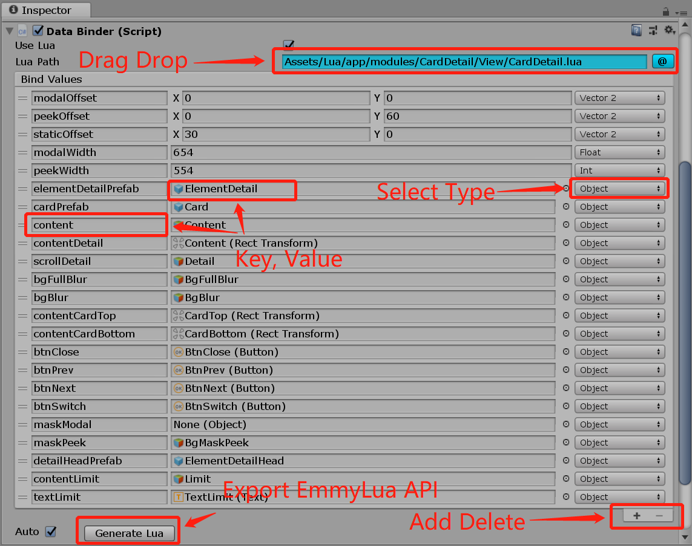
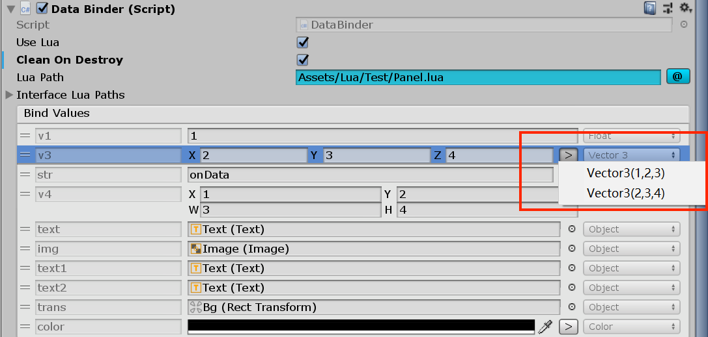
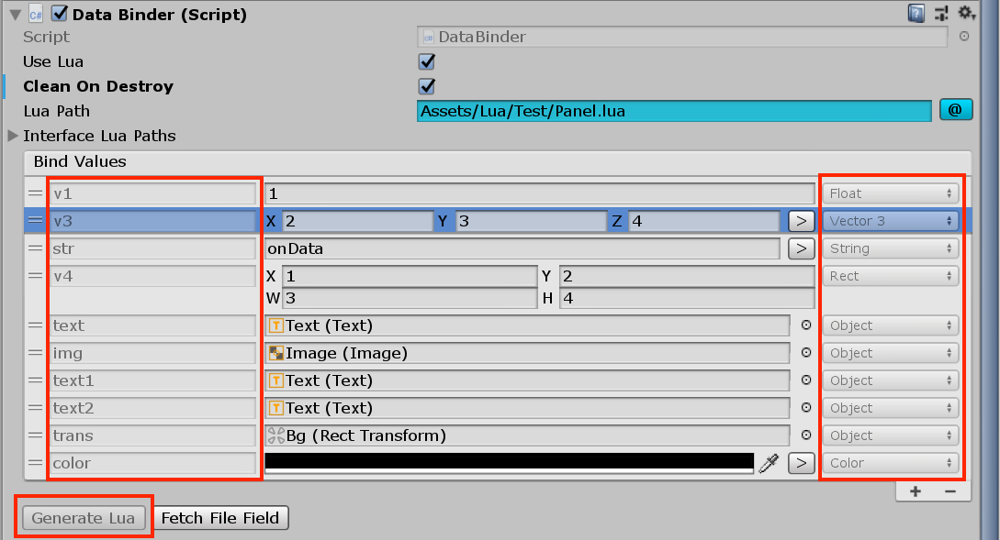
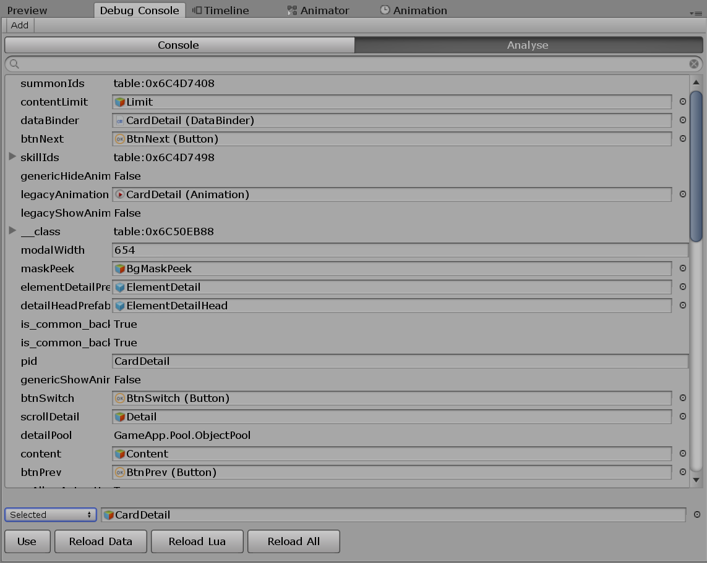
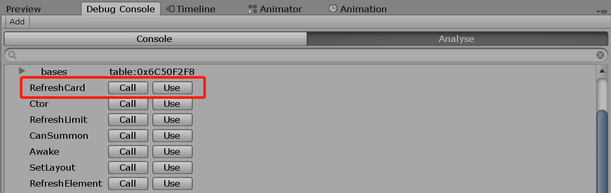
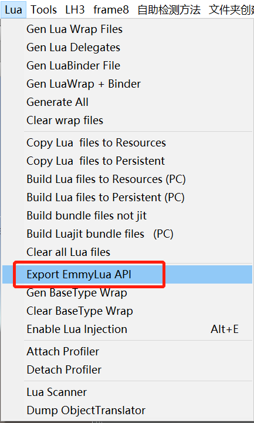
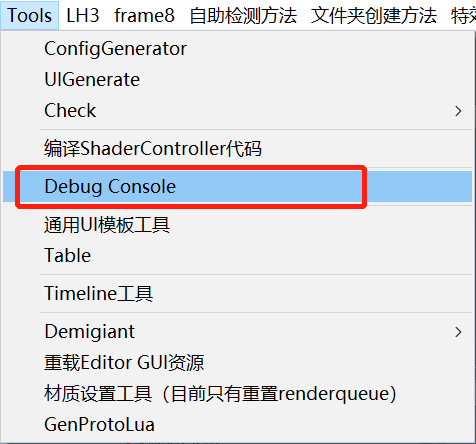

[TOC]


## 序列化

### 基本功能

序列化部分旨在存储配置化的数据，这些数据会随着Prefab保存和运行时实例化，并且在后续可以支持Reload



1. 选择关联的Lua脚本文件（lua文件需要return一个和文件同名的Class）
2. 绑定的数据类型支持数据类型，以及引用类型，左侧的Key值需保持唯一
3. 点击Generate Lua可以导出EmmyLua风格的Annotation，以便在编写lua代码时使用提示功能

### 字面量

对于字面量的使用这里的规则和emmyLua中的规则时一致的，在Editor窗格将解析字符串并使用字面量相应的值

```lua
---@field public v3 UnityEngine.Vector3 |"Vector3(1, 2, 3)"|"Vector3(2, 3, 4)"
---@field public str string |"'onClosed'"|"'onData'"
---@field public color UnityEngine.Color |"Color(1,1,1,1)"|"Color(0,0,0,0)"
```



### 类特征

静态代码意味着这个lua类中的property不可以从Editor窗口中生成，也不可以删减和修改当前已绑定的值的类型

```lua
---@class_type static
```



## 运行时动态绑定和重载

运行时可以进行LuaTable的数据重新绑定和代码重载，所有字段都会出现在树形结构中



1. Use: 使用当前选中的GameObject或者使用Lua代码获取Table数据
2. Reload Data: 当运行时在DataBinder中重新设置了字段时，需要重新加载到该LuaTable
3. Reload Lua: 当修改了该对象对应的lua脚本时，可以使用Reload Lua来加载lua代码逻辑
4. Reload All: 同时执行Reload Data和Reload Lua
5. 当需要重新执行Lua中的方法可以点击Call，当方法需要额外参数的时候可以点击Use，然后在Lua Console中执行_func(...)




## 功能入口



